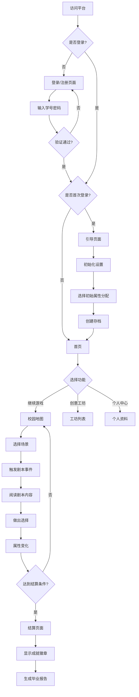
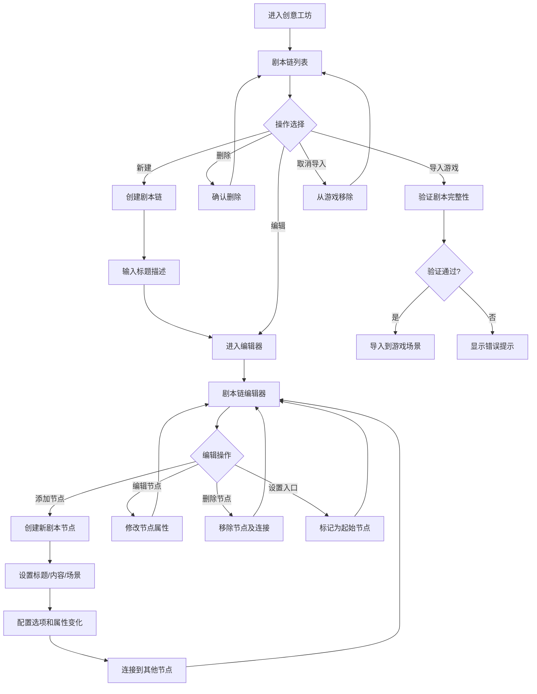
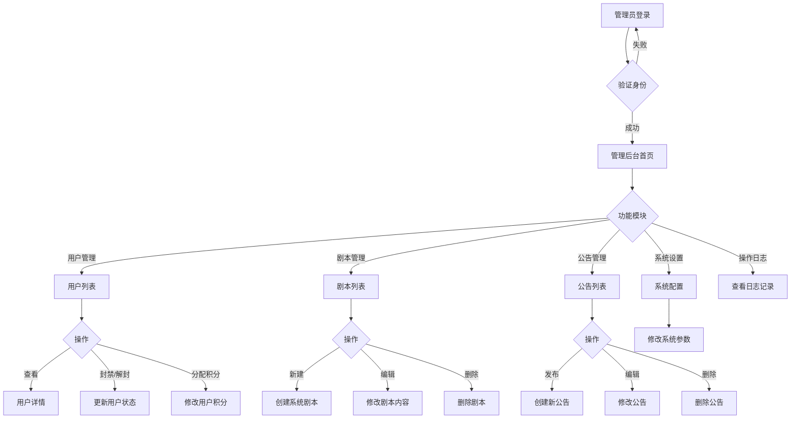
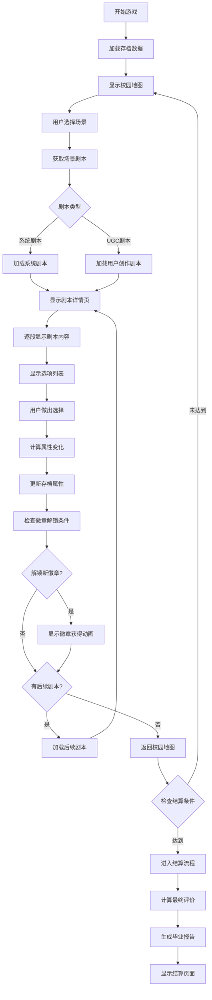
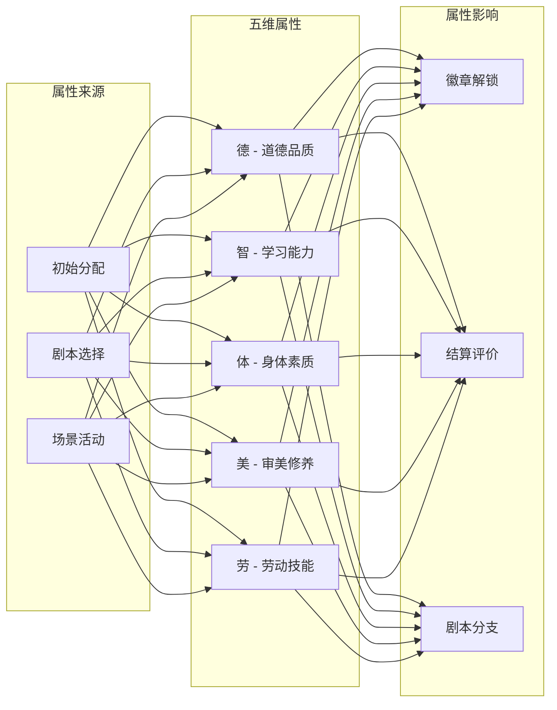

# 业务流程图 - 沉浸式大学模拟规划平台

## 1. 用户主流程

```mermaid
flowchart TD
    A[访问平台] --> B{是否登录?}
    B -->|否| C[登录/注册页面]
    C --> D[输入学号密码]
    D --> E{验证通过?}
    E -->|否| C
    E -->|是| F{是否首次登录?}

    B -->|是| F
    F -->|是| G[引导页面]
    G --> H[初始化设置]
    H --> I[选择初始属性分配]
    I --> J[创建存档]

    F -->|否| K[首页]
    J --> K

    K --> L{选择功能}
    L -->|继续游戏| M[校园地图]
    L -->|创意工坊| N[工坊列表]
    L -->|个人中心| O[个人资料]

    M --> P[选择场景]
    P --> Q[触发剧本事件]
    Q --> R[阅读剧本内容]
    R --> S[做出选择]
    S --> T[属性变化]
    T --> U{达到结算条件?}
    U -->|否| M
    U -->|是| V[结算页面]
    V --> W[显示成就徽章]
    W --> X[生成毕业报告]
```

## 2. 创意工坊流程

```mermaid
flowchart TD
    A[进入创意工坊] --> B[剧本链列表]
    B --> C{操作选择}

    C -->|新建| D[创建剧本链]
    D --> E[输入标题描述]
    E --> F[进入编辑器]

    C -->|编辑| F
    C -->|删除| G[确认删除]
    G --> B

    C -->|导入游戏| H[验证剧本完整性]
    H --> I{验证通过?}
    I -->|是| J[导入到游戏场景]
    I -->|否| K[显示错误提示]

    C -->|取消导入| L[从游戏移除]
    L --> B

    F --> M[剧本链编辑器]
    M --> N{编辑操作}

    N -->|添加节点| O[创建新剧本节点]
    O --> P[设置标题/内容/场景]
    P --> Q[配置选项和属性变化]
    Q --> R[连接到其他节点]

    N -->|编辑节点| S[修改节点属性]
    N -->|删除节点| T[移除节点及连接]
    N -->|设置入口| U[标记为起始节点]

    R --> M
    S --> M
    T --> M
    U --> M
```

## 3. 管理后台流程

```mermaid
flowchart TD
    A[管理员登录] --> B{验证身份}
    B -->|失败| A
    B -->|成功| C[管理后台首页]

    C --> D{功能模块}

    D -->|用户管理| E[用户列表]
    E --> F{操作}
    F -->|查看| G[用户详情]
    F -->|封禁/解封| H[更新用户状态]
    F -->|分配积分| I[修改用户积分]

    D -->|剧本管理| J[剧本列表]
    J --> K{操作}
    K -->|新建| L[创建系统剧本]
    K -->|编辑| M[修改剧本内容]
    K -->|删除| N[删除剧本]

    D -->|公告管理| O[公告列表]
    O --> P{操作}
    P -->|发布| Q[创建新公告]
    P -->|编辑| R[修改公告]
    P -->|删除| S[删除公告]

    D -->|系统设置| T[系统配置]
    T --> U[修改系统参数]

    D -->|操作日志| V[查看日志记录]
```

## 4. 游戏核心循环

```mermaid
flowchart TD
    A[开始游戏] --> B[加载存档数据]
    B --> C[显示校园地图]
    C --> D[用户选择场景]
    D --> E[获取场景剧本]

    E --> F{剧本类型}
    F -->|系统剧本| G[加载系统剧本]
    F -->|UGC剧本| H[加载用户创作剧本]

    G --> I[显示剧本详情页]
    H --> I

    I --> J[逐段显示剧本内容]
    J --> K[显示选项列表]
    K --> L[用户做出选择]

    L --> M[计算属性变化]
    M --> N[更新存档属性]
    N --> O[检查徽章解锁条件]
    O --> P{解锁新徽章?}
    P -->|是| Q[显示徽章获得动画]
    P -->|否| R{有后续剧本?}
    Q --> R

    R -->|是| S[加载后续剧本]
    S --> I
    R -->|否| T[返回校园地图]
    T --> U{检查结算条件}
    U -->|未达到| C
    U -->|达到| V[进入结算流程]

    V --> W[计算最终评价]
    W --> X[生成毕业报告]
    X --> Y[显示结算页面]
```

## 5. 属性系统说明

```mermaid
flowchart LR
    subgraph 五维属性
        DE[德 - 道德品质]
        ZHI[智 - 学习能力]
        TI[体 - 身体素质]
        MEI[美 - 审美修养]
        LAO[劳 - 劳动技能]
    end

    subgraph 属性来源
        A1[初始分配] --> DE & ZHI & TI & MEI & LAO
        A2[剧本选择] --> DE & ZHI & TI & MEI & LAO
        A3[场景活动] --> DE & ZHI & TI & MEI & LAO
    end

    subgraph 属性影响
        DE & ZHI & TI & MEI & LAO --> B1[徽章解锁]
        DE & ZHI & TI & MEI & LAO --> B2[结算评价]
        DE & ZHI & TI & MEI & LAO --> B3[剧本分支]
    end
```
