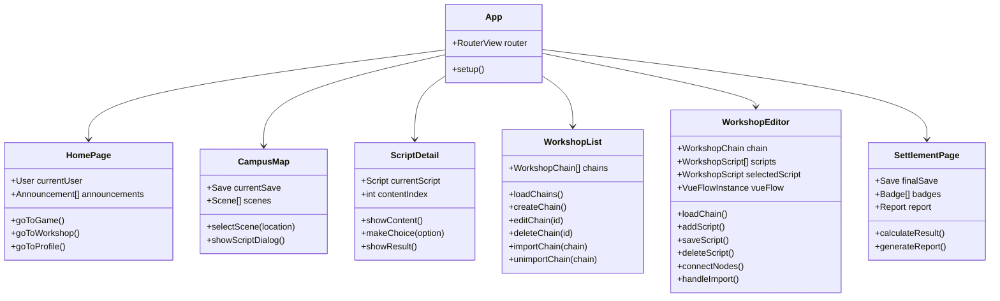

# 类图 - 沉浸式大学模拟规划平台

## 1. 核心领域模型类图

## 2. 创意工坊类图

## 3. 管理后台类图

## 4. 服务层类图

## 5. 前端组件类图

## 6. 数据库表关系图

## 7. 类图说明

### 核心实体
| 类名 | 说明 | 主要职责 |
|-----|------|---------|
| User | 用户实体 | 存储用户账号信息和基本属性 |
| Save | 存档实体 | 存储用户游戏进度和属性 |
| Script | 剧本实体 | 存储剧本内容和选项 |
| Badge | 徽章实体 | 存储成就徽章信息 |
| WorkshopChain | 剧本链实体 | 存储用户创作的剧本链 |
| WorkshopScript | 工坊剧本实体 | 存储剧本链中的单个节点 |
| Admin | 管理员实体 | 存储管理员账号信息 |

### 值对象
| 类名 | 说明 |
|-----|------|
| Attributes | 五维属性（德智体美劳） |
| AttributeChange | 属性变化值 |
| Position | 节点在编辑器中的位置 |
| ScriptOption | 剧本选项 |
| BadgeCondition | 徽章解锁条件 |
