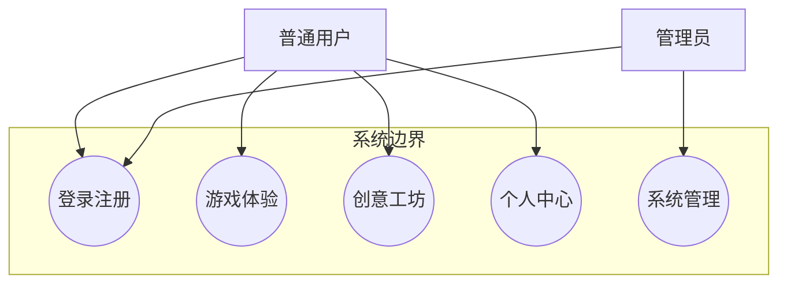
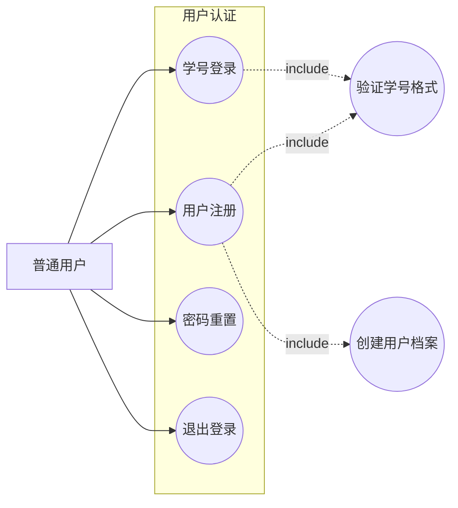
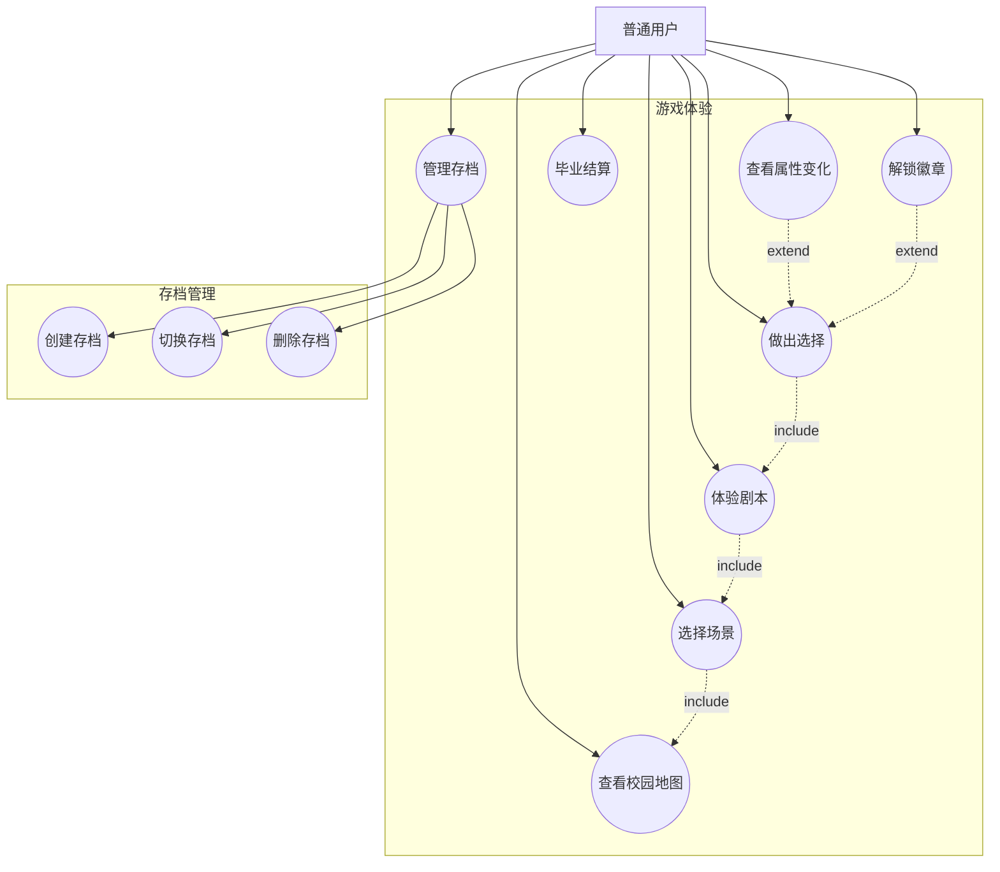
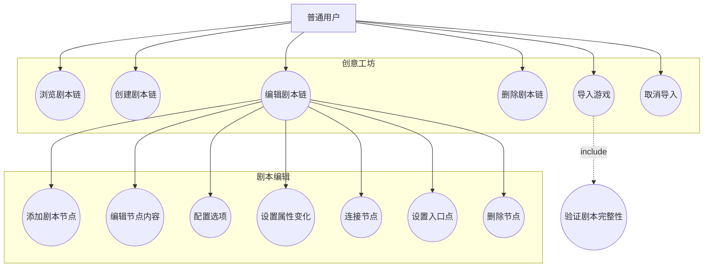
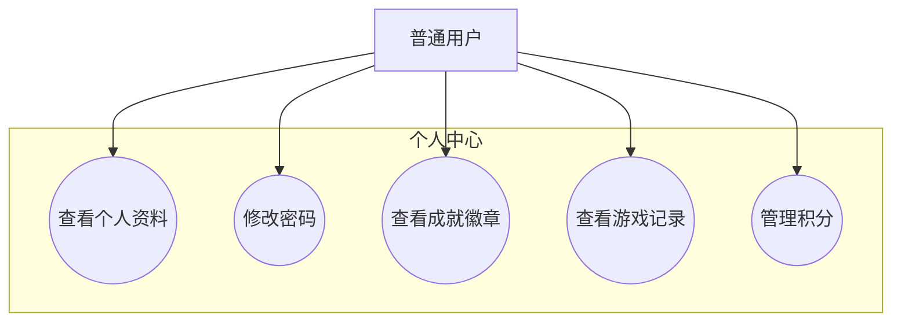
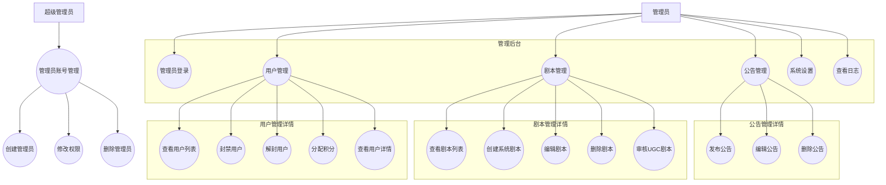

# 用例图 - 沉浸式大学模拟规划平台

## 1. 系统总体用例图

## 2. 用户认证用例

## 3. 游戏体验用例

## 4. 创意工坊用例

## 5. 个人中心用例

## 6. 管理后台用例

## 7. 用例说明表

| 用例编号 | 用例名称 | 参与者 | 前置条件 | 后置条件 |
|---------|---------|--------|---------|---------|
| UC-001 | 学号登录 | 普通用户 | 用户已注册 | 用户进入系统首页 |
| UC-002 | 用户注册 | 普通用户 | 无 | 创建用户账号 |
| UC-003 | 查看校园地图 | 普通用户 | 用户已登录 | 显示9个场景入口 |
| UC-004 | 体验剧本 | 普通用户 | 选择了场景 | 完成剧本流程 |
| UC-005 | 做出选择 | 普通用户 | 正在体验剧本 | 属性值变化 |
| UC-006 | 解锁徽章 | 普通用户 | 满足解锁条件 | 获得新徽章 |
| UC-007 | 毕业结算 | 普通用户 | 达到结算条件 | 生成毕业报告 |
| UC-008 | 创建剧本链 | 普通用户 | 用户已登录 | 创建新剧本链 |
| UC-009 | 编辑剧本链 | 普通用户 | 拥有剧本链 | 更新剧本内容 |
| UC-010 | 导入游戏 | 普通用户 | 剧本链完整 | 剧本可在游戏中体验 |
| UC-011 | 管理员登录 | 管理员 | 拥有管理员账号 | 进入管理后台 |
| UC-012 | 用户管理 | 管理员 | 管理员已登录 | 管理用户账号 |
| UC-013 | 剧本管理 | 管理员 | 管理员已登录 | 管理系统剧本 |
| UC-014 | 公告管理 | 管理员 | 管理员已登录 | 发布/管理公告 |
